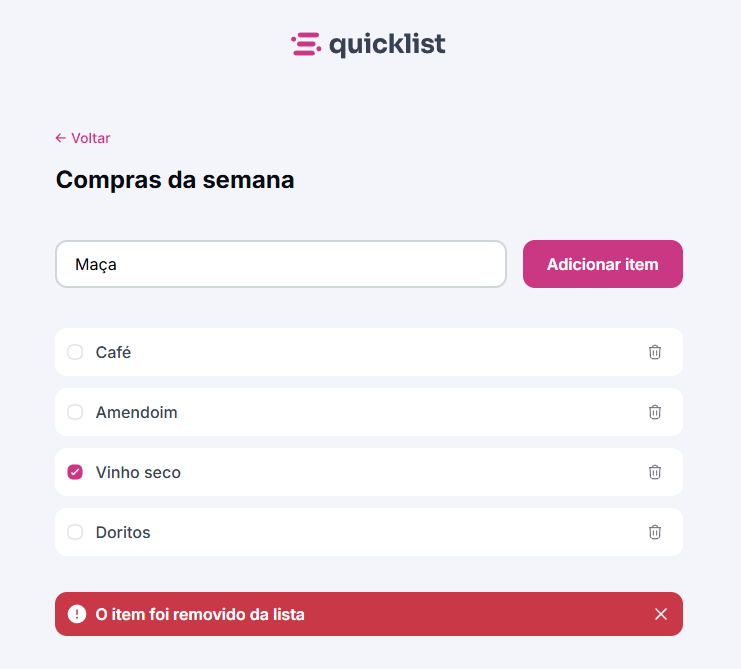

# 🛒 Quicklist - Lista de Compras

O Quicklist é um projeto desenvolvido com foco em JavaScript puro, criado para praticar a criação de scripts e a manipulação do DOM.
A aplicação simula uma lista de compras dinâmica, onde o usuário pode adicionar, remover e marcar itens comprados de forma simples e intuitiva.

## 🔗 Acesse o projeto online
Você pode visualizar o site publicado via GitHub Pages clicando no link abaixo:
👉 [Quicklist](https://llorenzojorge.github.io/projeto-quicklist)  

## 🧩 Sumário

- [Sobre o Projeto](#sobre-o-projeto)  
- [Funcionalidades & Destaques](#funcionalidades--destaques)
- [Tecnologias Utilizadas](#tecnologias-utilizadas)

## 📌 Sobre o Projeto

O Quicklist foi desenvolvido com o objetivo de praticar lógica de programação e manipulação do DOM em JavaScript, aplicando conceitos de eventos, criação dinâmica de elementos e armazenamento de dados em tempo real (na memória).

A proposta é permitir que o usuário crie uma lista de compras simples e funcional, sem precisar recarregar a página ou utilizar banco de dados.
Com um design limpo e responsivo, o Quicklist demonstra como pequenas interações podem ser feitas apenas com HTML, CSS e JS, mantendo a leveza e eficiência.

## ✨ Funcionalidades & Destaques

- Adicionar novos itens à lista
- Excluir itens existentes
- Marcar com checkbox os itens já comprados
- Atualização dinâmica do conteúdo (sem recarregar a página)
- Interface intuitiva e responsiva, feita com HTML e CSS puros
- Código leve e bem estruturado, ideal para aprendizado

## 🛠️ Tecnologias Utilizadas

- **Javascript** — manipulação de DOM e lógica da alpicação
- **HTML5** — estrutura semântica da aplicação  
- **CSS3** — estilização e responsividade 

---

Desenvolvido por [Lorenzo Jorge](https://github.com/llorenzojorge) 💻